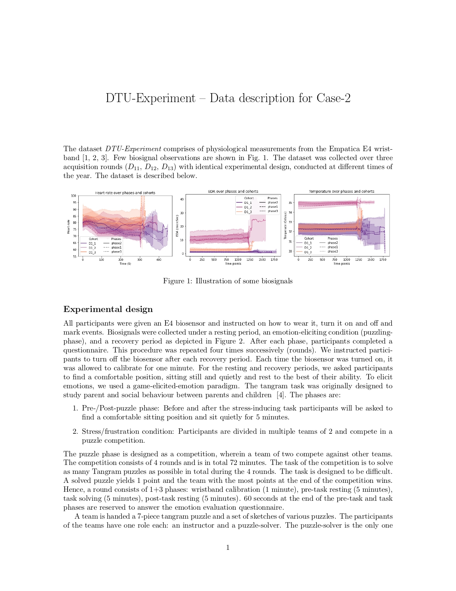
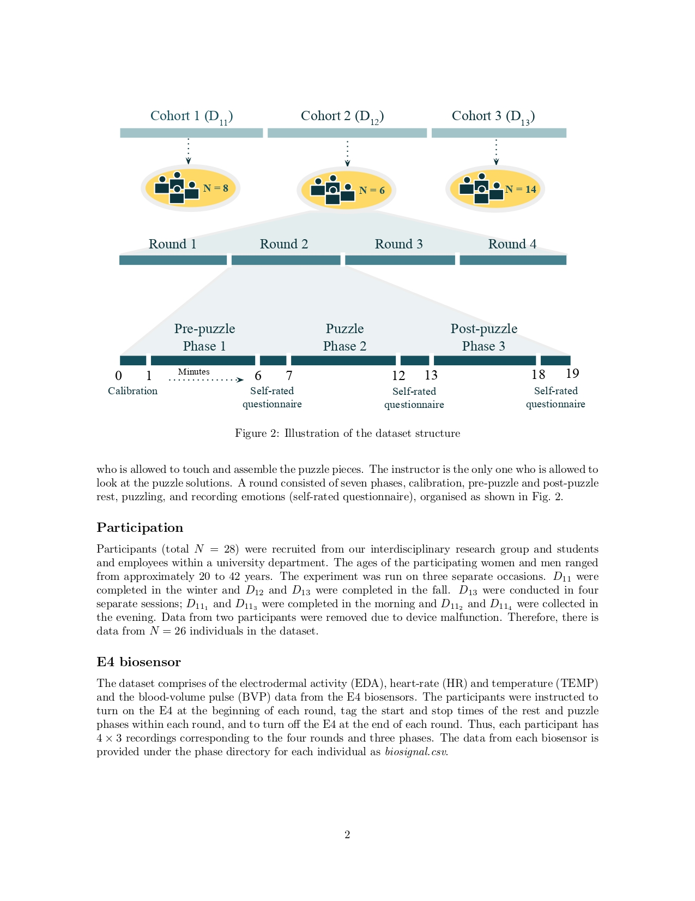
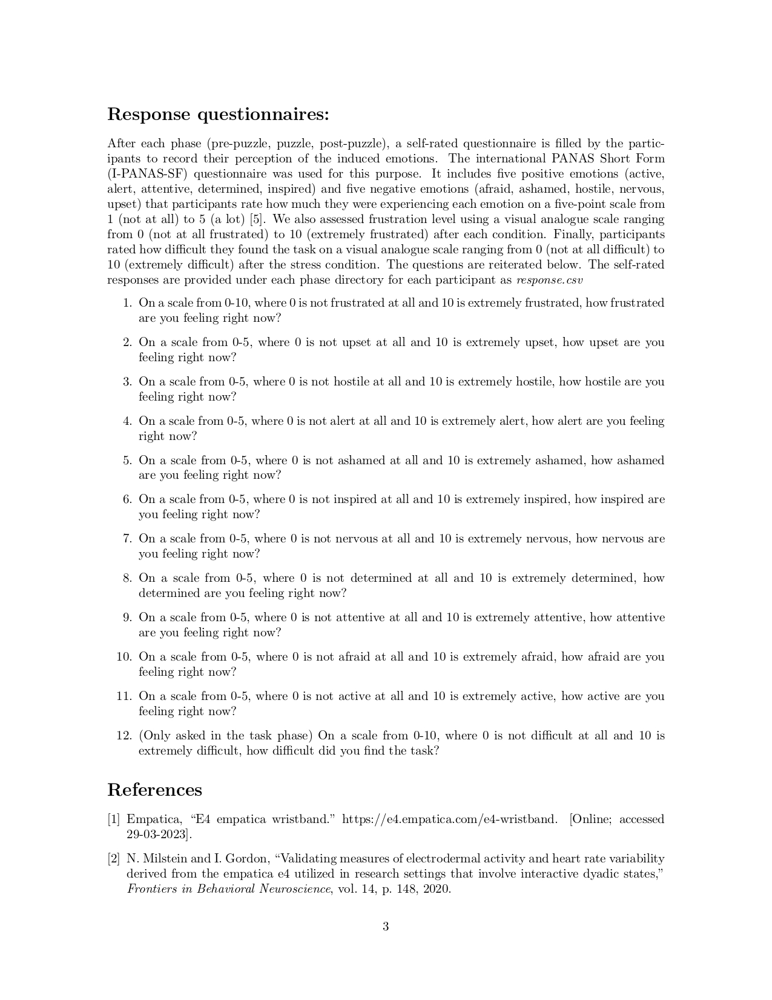
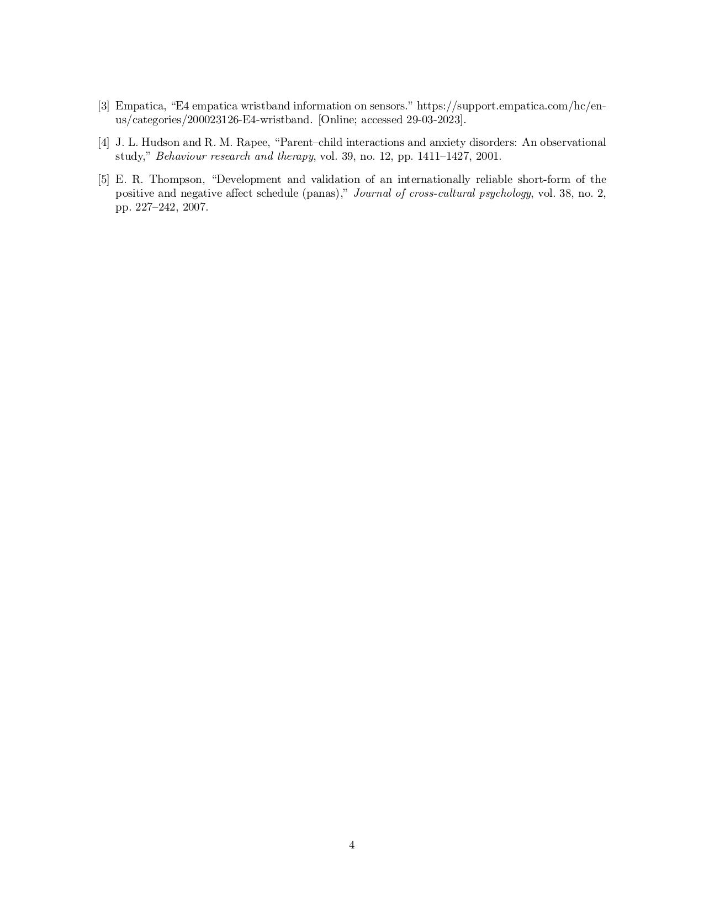

# E4-Biosensor-Dataset-Physiological-Measurements-and-Analysis
The aim of our project was to conduct an exploratory (unsupervised) analysis of the biosignal data collected from the Empatica E4 wristband in a controlled experiment based on solving a puzzle in teams of two, in order to discover interesting patterns, trends, or relationships within the data that can lead to further research.

-------------------------------------

# Dataset Description

