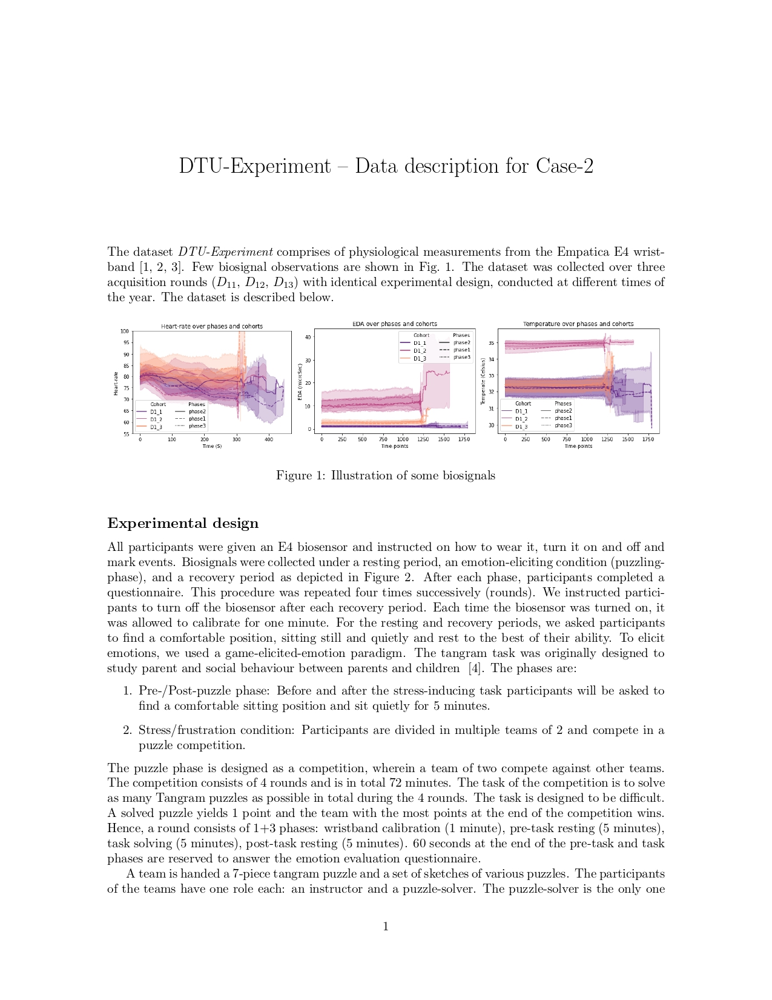
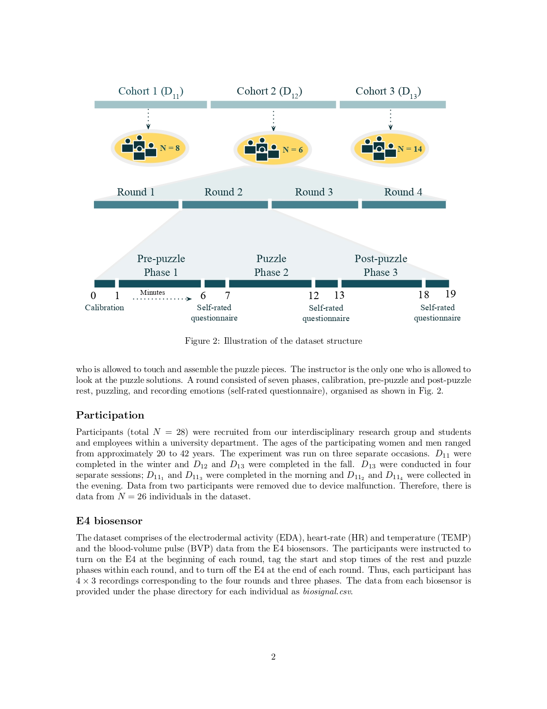
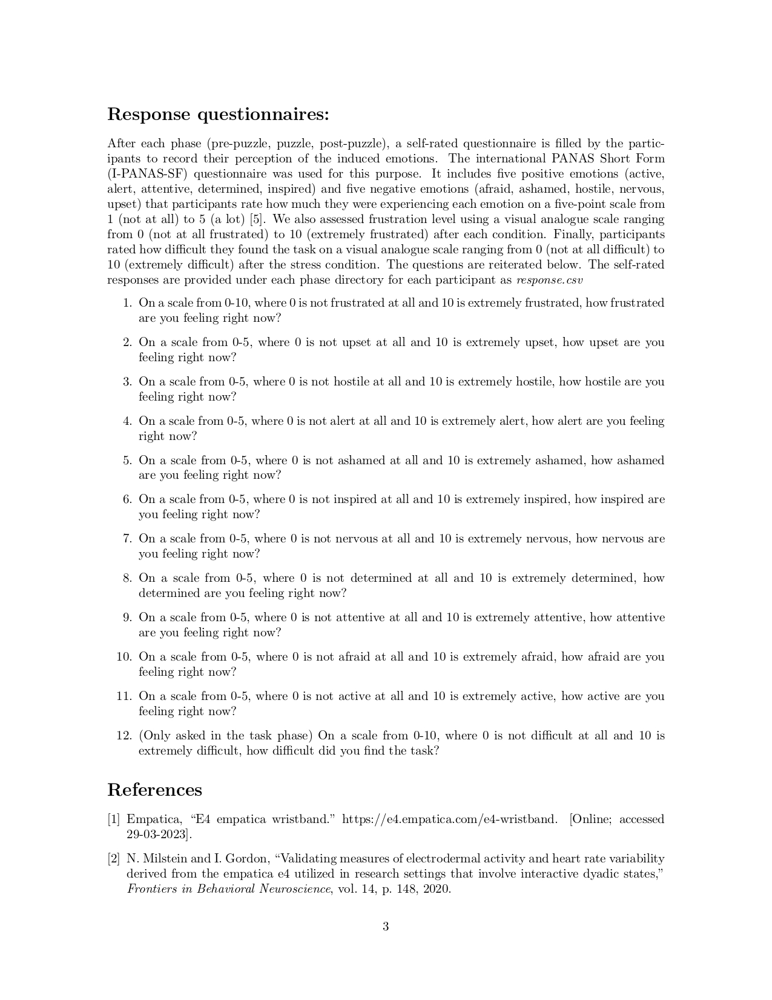
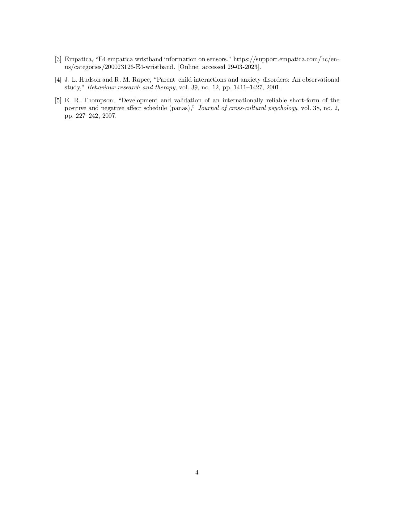

# E4-Biosensor-Dataset-Physiological-Measurements-and-Analysis
The aim of our project was to conduct an exploratory (unsupervised) analysis of the biosignal data collected from the Empatica E4 wristband in a controlled experiment based on solving a puzzle in teams of two, in order to discover interesting patterns, trends, or relationships within the data that can lead to further research.

-------------------------------------
## Keywords:
* Self-Organizing Map (SOM)
* U-matrix
* Principal Component Analysis (PCA)
* Physiological Responses
* Time Series Analysis
* K-means Clustering
* Spectral Clustering (SC)
* Cooperative Task
* Roles: Instructors, Solvers
* Description:

The project involves the analysis of physiological responses and behavioral patterns of participants engaged in a cooperative task as said above. The study uses various data analysis techniques, including:

- **Self-Organizing Maps (SOM):**

  - Two SOM representations
  - The SOMs are visualized using a U-matrix to show the distance between neurons, with longer distances indicating more dissimilarity.

- **Time Series Analysis Using Principal Component Analysis (PCA):**

  - PCA is applied to the time series data of participants.
  - The first principal component (PC1) scores are analyzed across four acquisition rounds.
  - Fluctuations in PC1 scores are observed, with some variations correlating with different phases of the task, particularly during stress-inducing puzzle phases.

- **Clustering Techniques:**

  - K-means clustering and spectral clustering (SC) are used to identify patterns in physiological and questionnaire data.
  - The clustering results indicate that physiological responses form distinct clusters different from those formed by questionnaire responses.

## Conclusions:
* The study finds that individual behavior in the cooperative task is more influenced by the assigned role (instructor or solver) and the partner they are paired with, rather than the task difficulty.

* Physiological indicators of both instructors and solvers show some differences but are generally similar, indicating a shared response to the experimental conditions despite different responsibilities.

* Unexpected results in PCA suggest the presence of additional hidden factors affecting participants' physiological responses beyond the anticipated stress from the puzzle task. These findings prompt further investigation into these hidden factors.

-----------------------------

# Project Description

# Dataset
https://drive.google.com/file/d/1Nf9s_oLWOVPcinEZcjQK5BmglwKD4P4s/view?usp=drive_link

